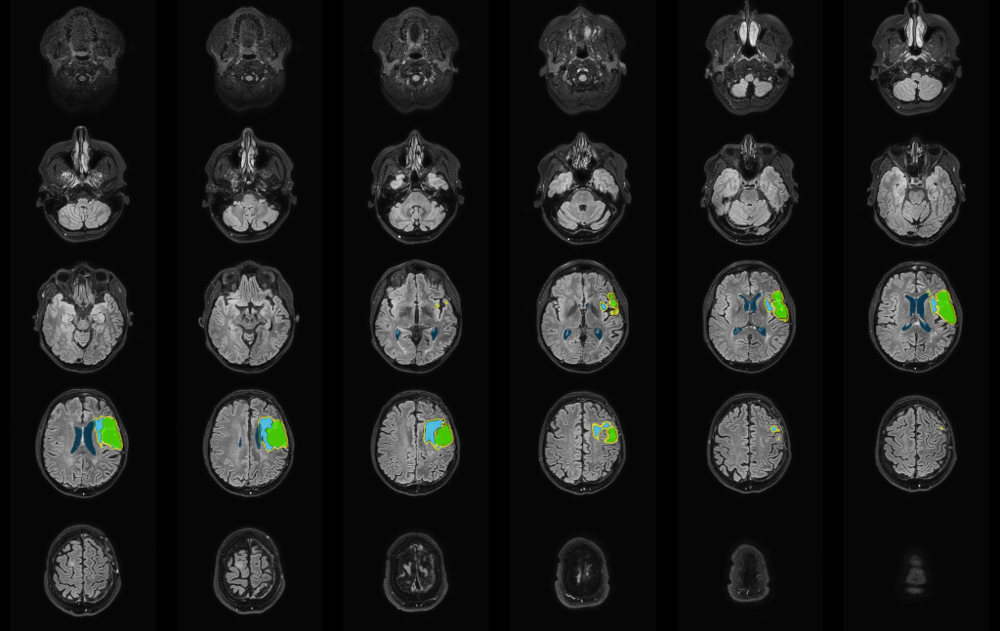

# KUL_anat_segment_tumor

## Purpose

This script segments pre- or post-operative brain tumor lesions and/or resection cavities using a combination of AI tools hd-glio-auto, resseg and fastsurfer.

## Required structural input data

Required are data organised in BDIS:
- a T1w image without contrast
- a T1w image with contrast (ce-gadolinium in the bids name)
- a FLAIR image
- a T2w image

## Preprocess the data first

Above input images need to be bias-corrected and co-registered.
To do so run KUL_anat_biascorrect and KUL_anat_register_rigid.

## Usage

A typical command for running the segmentation is:  

`KUL_anat_segment_tumor.sh -p Pat009`

A typical command to inspect the segmentation in mrview is:

`KUL_anat_segment_tumor.sh -p Pat009 -R`

You need to be in **main** directory to run this command. This is also where the BIDS folder will be created. 

For info about the command just run:

`KUL_anat_segment_tumor.sh`

## Output

Binary masks of:
- solid tumor tissue (sub-participant_hdglio_lesion_solid.nii.gz)
- perilesion tissue (sub-particiapnt_hdglio_lesion_perilesion_tissue.nii.gz)
- a resection cavity (sub-participant_resseg_cavity.nii.gz)
- a combination of the 3 about, connected, filled and cleaned (sub-participant_lesion_full.nii.gz)
- ventricles (sub-participant_fastsurfer_ventricles.nii.gz)

A png image with these masks overlaid on the FLAIR image. 

## Depedencies

A cuda compatible GPU with at least 6GB memory.

Internally KUL_anat_segment_tumor uses:
- [hd-glio-auto](https://github.com/NeuroAI-HD/HD-GLIO-AUTO)
- [resseg](https://github.com/fepegar/resseg)
- [fastsurfer](https://github.com/Deep-MI/FastSurfer)
- [mrtix3](https://www.mrtrix.org/)

These could be installed using [KUL_Linux_Installation](https://github.com/treanus/KUL_Linux_Installation)
